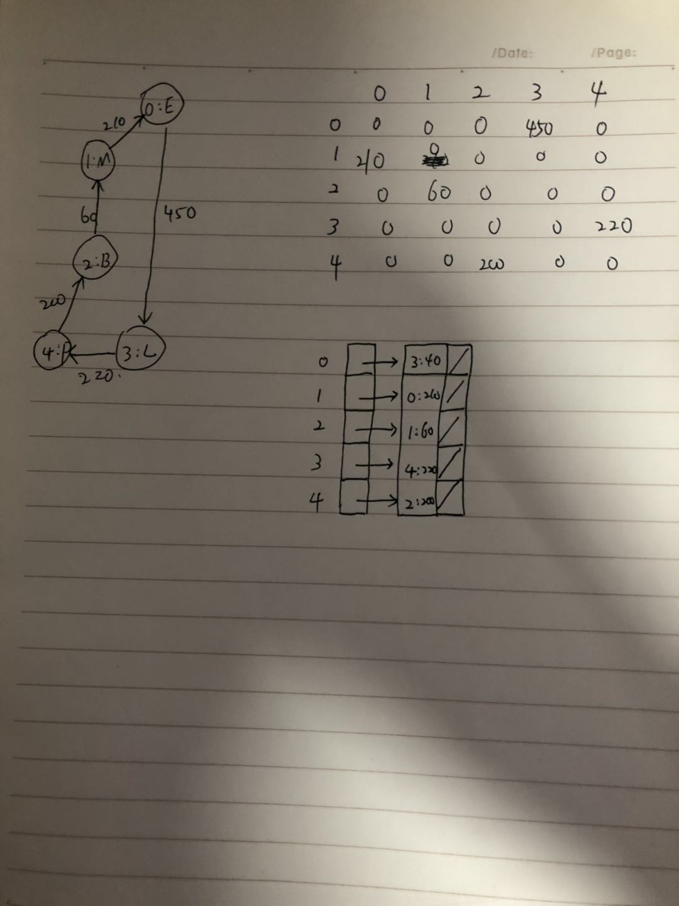

学习笔记

#HashMap的实现原理探究
    
   1. HashMap使用了数组 + 链表 + 红黑树的三种数据结构来实现，数组中的每个元素时链表，当每条链的长
      度超过设置值时，链表就会转换为红黑树存储数据，而红黑树的时间复杂度为O(logn)
   2. put元素进入HashMap时，会用元素的hashCode直接计算出数组中的索引index, 由此会直接得到对应的链表。
      基于得到的链表会有三种情况：
        a. 如果得到的链表为null，则直接将新元素作为头节点，放置于数组位置中。
        b. 如果不为null， 接着判断这条链表是否为红黑树，如果是则进行黑色树的插入操作。判断的逻辑也很简单，即 T instanceof TreeNode
        c. 如果不为null， 也不是一颗红黑树，则将元素插入链表尾部。 接着判断链表的长度是否超过默认值，超过就将当前链表转换为红黑树
        
   3. get元素时， 先计算出key的hashcode得到index， 进一步得到index对应的链表， 判断当前链表元素是否为null或者next是否为null。这两
      种情况都可以直接return了，前者return null，后者直接return 链表队首元素。否者，判断当前链表是否为红黑树，是的话就在红黑树中，查到key
      ；不是红黑树时，就当成普通链表进行遍历，一边遍历一边比较key是否相等，直到找到相等的key，或者遍历完数组
      
      
      
      
# 有向有权图的零阶矩阵和邻接表

# 图
 1. 图有点，边和权重； 
 2. 入度和出度，对于有向图来说，指向这个点的线记为入读，这个点指向其他点成为出度。 
    对于无向图来说，入读和出度的值是相等。
 3. 权重，即为边长。
 
 
# 二叉树
1. 前序遍历： 父节点 ——> 左节点 ——> 右节点
2. 中续遍历： 左节点 ——> 父节点 ——> 右节点
3. 后续遍历：左节点 ——> 右节点 ——>   父节点 